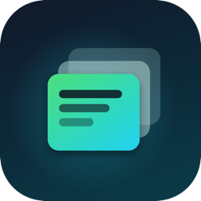
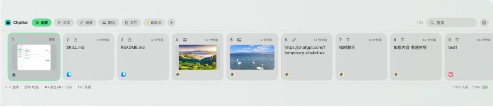
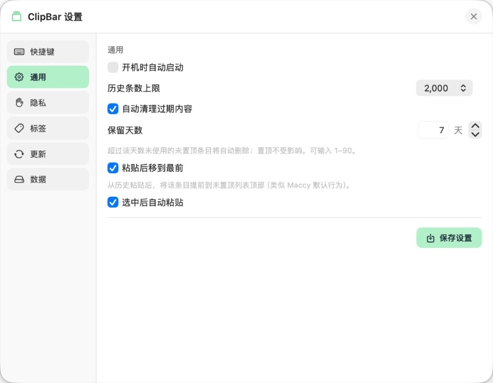

<p align="center">
  
</p>

<h1 align="center">ClipBar</h1>

<p align="center">
  <strong>Local-first clipboard manager for macOS</strong><br />
  Keyboard-first · Fast · Minimal · Private by default
</p>

<p align="center">
  <a href="README_CN.md">中文文档</a>
  ·
  <a href="https://github.com/BaaKoo9/ClipBar/releases">Download</a>
  ·
  <a href="https://github.com/BaaKoo9/ClipBar/releases/latest">Latest Release</a>
</p>

---

Summon with a hotkey, pick with arrow keys, paste with Enter — without leaving the keyboard.

<p align="center">
  
</p>

## Highlights

- **Snapshot bar** — horizontal cards with type filters and custom labels
- **Sequential paste** — enqueue copies, dequeue in order with a side queue
- **Instant search** — keyword highlight; `#tag` jumps to a label
- **Local-first privacy** — clipboard history stays on your Mac (SQLite + media cache)
- **Zero third-party deps** — Swift + SwiftUI + AppKit only

## Requirements

| | |
|---|---|
| macOS | **14 Sonoma** or later (incl. 15 Sequoia) |
| Chip | Apple Silicon & Intel |
| Permissions | **Accessibility** + **Input Monitoring** (hotkeys & auto-paste) |

## Install

Grab the latest build from [Releases](https://github.com/BaaKoo9/ClipBar/releases):

| Asset | Use when |
|---|---|
| **`ClipBar-x.y.z.pkg`** | Double-click → installs into Applications (recommended) |
| **`ClipBar-x.y.z.dmg`** | Open → drag `ClipBar.app` onto **Applications** |

### First open (not notarized)

Builds are self-signed and **not Apple-notarized**. If macOS blocks the first launch:

1. **Recommended**: Finder → **Control-click** ClipBar → **Open** → confirm **Open**
2. Or **System Settings → Privacy & Security** → **Open Anyway**

Then enable for ClipBar:

- Accessibility  
- Input Monitoring  

## Quick start

| Action | Default shortcut |
|---|---|
| Summon / dismiss panel | `⌥⌘V` |
| Enqueue (copy selection + queue) | `⌥⌘E` |
| Dequeue paste | `⌥⌘D` |
| Select in panel | `←` `→` |
| Paste selection | `Enter` or click |
| Enqueue from panel | `⌘`-click or hover `⊕` |

All shortcuts are customizable in Settings.

<p align="center">
  
</p>

## Features

- Menu-bar resident; records text, links, images, files, and RTF
- Pin / favorite (excluded from capacity cleanup); optional bump-on-paste
- Dedup: identical content refreshes timestamp instead of stacking
- Labels: create, drag-reorder, edit/delete in panel; manage in Settings
- History limit + optional day-based retention (1–90 days, unpinned only)
- Ignore apps; launch at login; in-app update check with download progress
- About window with version and project link

> Clipboard **content** never leaves your machine. The optional updater only talks to GitHub Releases (with download mirrors) when you check for updates.

## Build from source

macOS 14+ with Xcode Command Line Tools (full Xcode not required):

```bash
./scripts/build-app.sh          # dist/ClipBar.app
./scripts/make-pkg.sh           # dist/ClipBar-x.y.z.pkg
./scripts/make-dmg.sh           # dist/ClipBar-x.y.z.dmg
./scripts/run-tests.sh          # core unit tests
```

## Tests

```bash
swift run CoreTests
```

Covers insert/fetch, dedup, search, pin protection, clear, paste-back for text/image/file/RTF, hotkey registration, legacy DB migration, and a 10k-item perf check (fetch &lt;10ms, search &lt;5ms).

## Stack

- Swift + SwiftUI + AppKit — no SPM third-party packages
- SQLite (system): serialized writes, retention + history-limit cleanup
- Carbon global hotkeys + CGEventTap
- PNG storage + JPEG thumbnails; RTF preserved for rich text

## Roadmap

- [x] Clipboard monitor & local store
- [x] Snapshot bar, search, paste-back
- [x] Custom hotkeys (summon / enqueue / dequeue)
- [x] Sequential paste, pin, ignore apps, launch at login
- [x] App icon, pkg + dmg, about window
- [x] Queue side panel; custom labels; update checks
- [ ] iCloud private sync; richer type detection (colors, code)

## License

Source-available for personal use. All rights reserved.
